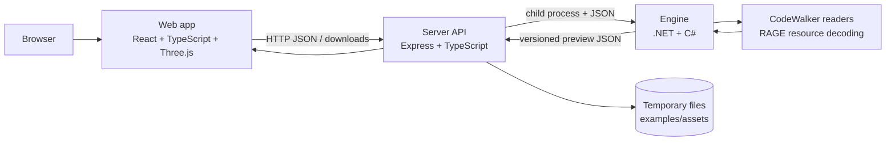
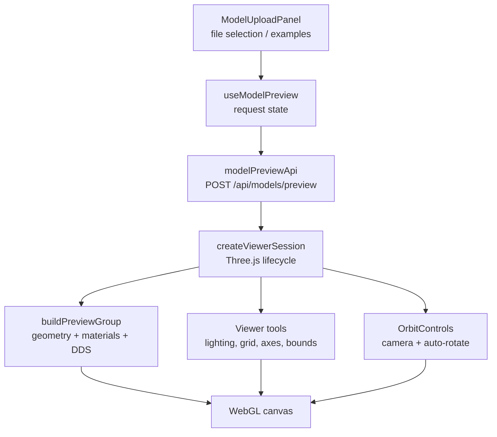
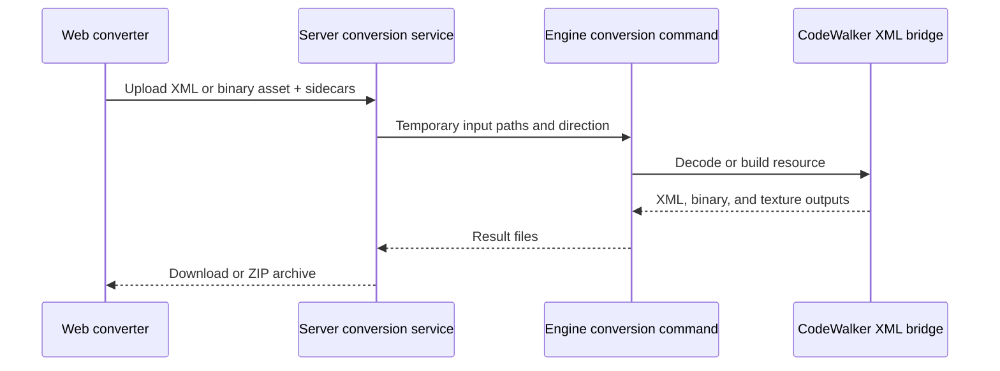

# FiveMesh architecture

FiveMesh is split into three applications with one stable data boundary. The
Engine understands GTA V resources, the Server manages files and processes, and
the Web app owns interaction and rendering.

## System boundaries



The preview contract is deliberately neutral. It contains model metadata,
meshes, UVs, bounds, material identifiers, and texture payloads without
exposing CodeWalker's internal types to the Web or Server.

## Viewer runtime



Viewer controls are kept outside geometry construction. A new tool should add
an explicit session method rather than reaching into Three.js objects from a
React component. This keeps rendering state disposable when a different model
is loaded.

## Conversion runtime



## Change map

| If you are changing... | Start here | Then update |
| --- | --- | --- |
| Decoding or a new GTA V format | `apps/engine/Application` and `Infrastructure/CodeWalker` | Engine contracts, Server validation, Web file labels |
| Preview data | Engine contracts | `apps/server/src/services/EngineClient.ts`, Web preview types |
| Upload or temporary files | `apps/server/src/features` | API client and user-facing error states |
| Viewer rendering | `apps/web/src/features/model-viewer/viewer` | Viewer controls and focused Web tests |
| Viewer controls | `viewerTools.ts`, `createViewerSession.ts` | `ViewerPanel.tsx`, `viewer.css` |
| Conversion | `apps/engine/Cli` and `apps/server/src/features/conversion` | Converter page and download handling |
| Hosted examples | `examples/assets` | Example scanner only; no code change is normally required |
| Add an RP practice game | `apps/web/src/features/<game>` | Add a route, app catalogue entry, and focused game stylesheet |

## Project map

```text
FiveMesh/
|-- apps/
|   |-- engine/                 .NET resource decoder and conversion use cases
|   |   |-- Cli/                command parsing and operation routing
|   |   |-- Application/        preview and conversion workflows
|   |   |-- Contracts/          stable output models
|   |   `-- Infrastructure/     CodeWalker-specific readers
|   |-- server/src/
|   |   |-- features/models/    upload, examples, and preview routes
|   |   |-- features/conversion XML/binary conversion routes
|   |   |-- services/            Engine process and file lifecycle
|   |   `-- middleware/          CORS and shared HTTP behavior
|   `-- web/src/
|       |-- app/                route composition and application shell
|       |-- api/                typed HTTP boundaries
|       |-- features/
|       |   |-- home/           public product landing page
|       |   |-- examples/       hosted example catalogue
|       |   |-- model-upload/   upload selection and request state
|       |   |-- model-viewer/   viewer page, controls, and Three.js runtime
|       |   |-- hack-practice/ browser-only RP practice games
|       |   `-- conversion/     XML/binary converter page
|       |-- components/         shared navigation and UI
|       |-- styles/             feature-level CSS
|       `-- types/              browser-side preview contracts
|-- examples/assets/            local or hosted demo assets
|-- docs/                       architecture, project map, and development notes
`-- build/                      generated production output (not source)
```

The next natural extension points are material inspection, mesh visibility,
vehicle extras, and additional RAGE resource formats. They can be added as
separate features without moving the current upload, conversion, or viewer
boundaries.
