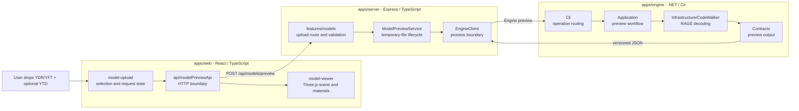
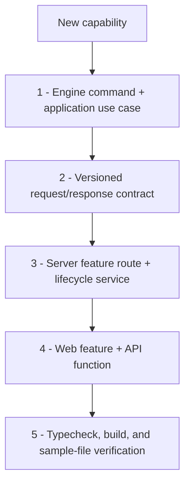

# FiveMesh project map

## Current preview flow



The boundary between applications is the versioned preview JSON. Engine owns
how GTA V files are decoded, Server owns execution and transport, and Web owns
interaction and rendering.

## Folder responsibilities

```text
FiveMesh/
|-- apps/
|   |-- engine/
|   |   |-- Cli/               Command parsing and operation routing
|   |   |-- Application/       Use cases such as preview, export, or edit
|   |   |-- Contracts/         C# output models
|   |   `-- Infrastructure/
|   |       `-- CodeWalker/    CodeWalker-specific readers and extractors
|   |-- server/src/
|   |   |-- features/          HTTP features grouped by user capability
|   |   |-- services/          External process and service boundaries
|   |   |-- middleware/        Shared Express behavior
|   |   |-- routes/            Small general routes
|   |   `-- errors/            Predictable HTTP errors
|   `-- web/src/
|       |-- api/               Server calls
|       |-- components/        Shared visual components
|       |-- features/          Upload and viewer capabilities
|       |-- styles/            CSS split by responsibility
|       `-- types/             Browser-side contracts
|-- examples/                  Hosted demo assets and manifest
`-- docs/                      Architecture and development guidance
```

## Where future changes go

| Change | Engine | Server | Web |
| --- | --- | --- | --- |
| Support another RAGE model format | Add a loader and map it to the neutral contract | Allow the extension | Add it to the file picker and labels |
| Add model transforms | Add a new `transform` command and transformation use case | Add `/api/models/transform` and manage its files | Add an editor feature and transform controls |
| Export a changed model | Add an `export` command and CodeWalker writer | Stream the generated file | Add an export action and download handling |
| Improve material accuracy | Extract more shader parameters | Pass the versioned result unchanged | Map the new material fields to Three.js |
| Add a hosted example model | No change unless the format is new | Add the asset entry to the examples manifest | Show it on the home screen |
| Add jobs or progress | Emit machine-readable progress events | Run Engine behind a job service | Add progress and cancellation UI |
| Add persistence | Keep Engine stateless | Add a repository/storage service | Add project browsing and save states |

## Adding an operation



Keep CodeWalker types inside `apps/engine/Infrastructure/CodeWalker`. The
Server and Web should only know the neutral preview JSON. This keeps future
editors, exporters, thumbnail generators, and batch converters independent from
the current preview screen.
