# Roadmap

FiveMesh is currently a local preview pipeline for YDR/YFT assets with optional
YTD textures. The graph below is arranged like a JSONCrack-style structure map:
each node is a capability, and each edge shows what should unlock the next layer.

## Capability Graph

```mermaid
flowchart LR
    Root["FiveMesh"]

    subgraph Preview["Preview Pipeline"]
        Decode["Decode YDR/YFT"]
        Textures["Resolve YTD textures"]
        Materials["Improve shader/material mapping"]
        MissingTextures["Warn about missing shared dictionaries"]
        Fixtures["Add legal sample fixtures or stubs"]
    end

    subgraph Contracts["Contracts"]
        Schema["Versioned preview schema"]
        GeneratedTypes["Generate TypeScript types from schema"]
        ContractTests["Contract drift checks"]
    end

    subgraph Editor["Editor Foundation"]
        SceneState["Scene selection state"]
        TransformControls["Transform controls"]
        UndoRedo["Undo/redo command history"]
        EngineTransform["Engine transform command"]
        ExportCommand["Engine export command"]
    end

    subgraph Server["Server Pipeline"]
        Jobs["Long-running job service"]
        Progress["Progress events"]
        Cancellation["Cancellation"]
        Download["Generated file streaming"]
    end

    subgraph Products["Future Products"]
        Batch["Batch conversion"]
        Thumbnails["Thumbnail generation"]
        Persistence["Saved projects and texture dictionaries"]
        Desktop["Packaged desktop app"]
    end

    Root --> Decode
    Decode --> Textures
    Textures --> Materials
    Textures --> MissingTextures
    Decode --> Fixtures

    Root --> Schema
    Schema --> GeneratedTypes
    GeneratedTypes --> ContractTests
    ContractTests --> Materials

    Materials --> SceneState
    SceneState --> TransformControls
    TransformControls --> UndoRedo
    TransformControls --> EngineTransform
    EngineTransform --> ExportCommand

    EngineTransform --> Jobs
    ExportCommand --> Jobs
    Jobs --> Progress
    Jobs --> Cancellation
    Jobs --> Download

    Download --> Batch
    Download --> Thumbnails
    Jobs --> Persistence
    Persistence --> Desktop
    Thumbnails --> Desktop
```

## Priority Layers

| Layer | Focus                                                      | Why it matters                                                    |
| ----- | ---------------------------------------------------------- | ----------------------------------------------------------------- |
| 1     | Fixtures, generated types, material warnings               | Makes the viewer safer to change and easier to test               |
| 2     | Better materials, shader parameters, missing dictionary UX | Makes preview output look closer to CodeWalker and in-game assets |
| 3     | Selection, transforms, undo/redo                           | Turns the viewer into the base of an editor                       |
| 4     | Engine export, job progress, cancellation                  | Makes heavy model operations usable from the Web app              |
| 5     | Batch tools, thumbnails, persistence, desktop packaging    | Turns FiveMesh into a broader asset workflow                      |

## Implementation Rule

When a roadmap item crosses app boundaries, update it in this order:

1. `packages/contracts`
2. `apps/engine`
3. `apps/server`
4. `apps/web`
5. `docs`

That keeps the project growing from a stable contract instead of letting the UI,
API, and decoder drift apart.
